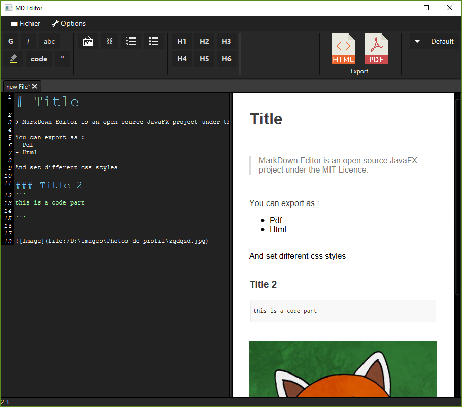

# Markdown Editor

An open source markdown editor written in `JavaFX`.

## Features
- Create or edit markdown and html files
- Html preview
- Style selection (**CSS**)
- **Pdf** and **Html** export
- Syntax highlighting

## Dependencies
This project is using [RichTextFX](https://github.com/FXMisc/RichTextFX)

Pdf and HTML icons made by Smashicons from [FlatIcon](www.flaticon.com)

Based on [Github flabored markdown](https://github.github.com/gfm/)

# Download
*Coming soon*.

# License
Licensed under [MIT Licence](https://github.com/kiidness/Markdown-Editor/blob/master/LICENSE).
